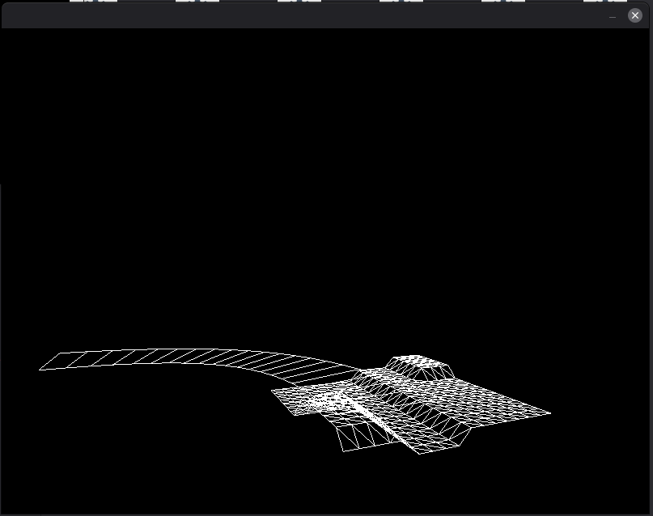

Copyright (c) 2026 Gaël Fortier

## Disclaimer / Avertissement
This experimental project was made in 2021; it is very old. It seems to only run on windows or on linux with Wine. I was incapable to compile the project natively to linux. 

Ce projet expérimental a été fait en 2021; il est très vieux. Le projet semble fonctionner que sur windows ou sur linux avec Wine. J'ai été incapable de compiler nativement sur linux.

## Screenshot / Capture d'écran

In the screenshot, there are 2 elements displayed : 1. there is an .obj file that was loaded and displayed; 2. there is a spline that was generated at runtime (the curved wireframe model going to the left). 

Dans la capture d'écran, il y a 2 éléments: 1. un fichier .obj qui a été chargé et affiché; 2. un spline généré à l'exécution (le wireframe courbé qui va à gauche). 
